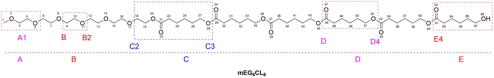

# mPEG2k-PCL2k structure preparation

This directory contains the source files and final structure used to construct the mPEG2k-PCL2k carrier.

```text
polymer/
├── EG6CL6/
│   ├── EG6CL6.gro
│   ├── EG6CL6.top
│   ├── EG6CL6.itp
│   ├── EG6CL6.prm
│   └── ...
└── mpeg2kpcl2k/
    ├── mpeg2kpcl2k.pdb
    ├── mpeg2kpcl2k.itp
    ├── mpeg2kpcl2k.prm
    └── mpeg2kpcl2knpt4ns.pdb
```

## 1. Polymer reconstruction with ztop

The full mPEG2k-PCL2k chain was reconstructed from the lower-molecular-weight **EG6CL6** template using the **ztop** Python package (CoordMagic; https://gitee.com/coordmagic/coordmagic; http://bbs.keinsci.com/thread-24122-1-1.html).



Five reusable fragments were defined:

- A: methoxy-PEG head group
- B: PEG repeat unit
- C: PEG-PCL junction
- D: PCL repeat unit
- E: terminal PCL-OH group

The reconstruction commands were:

```bash
python ztop.py -f "A;p=EG6CL6.top;x=EG6CL6.gro;site=A1:5-6;resname=MEG;comment=MEG as Head" --savelib

python ztop.py -f "B;p=EG6CL6.top;x=EG6CL6.gro;site=B:9-8,B2:11-12;resname=EGO;comment=EG repeat" --savelib

python ztop.py -f "C;p=EG6CL6.top;x=EG6CL6.gro;site=C2:18-17,C3:28-29;resname=ECC;comment=EG-CL-CL" --savelib

python ztop.py -f "D;p=EG6CL6.top;x=EG6CL6.gro;site=D:45-44,D4:52-53;resname=PCL;comment=CL repeat" --savelib

python ztop.py -f "E;p=EG6CL6.top;x=EG6CL6.gro;site=E4:61-60;resname=CLO;comment=CL-OH end" --savelib

python ztop.py --loadlib   -b ABBBBBBBBBBBBBBBBBBBBBBBBBBBBBBBBBBBBBBBBBBBCDDDDDDDDDDDDDDE   -o mpeg2kpcl2k.top,mpeg2kpcl2k.pdb
```

The reconstructed structure and topology were manually checked before equilibration.

## 2. Polymer equilibration

The ztop-generated polymer was not used directly as the starting polymer conformation for the production systems. It was first equilibrated in GROMACS:

```text
mpeg2kpcl2k.pdb
→ energy minimization
→ 2 ns NVT
→ 4 ns NPT
→ mpeg2kpcl2knpt4ns.pdb
```

The final NPT-equilibrated structure was exported as:

```text
mpeg2kpcl2knpt4ns.pdb
```

This is the **actual polymer coordinate file used by Packmol** when constructing the pairwise prodrug-polymer and multi-molecule systems in this repository.

The polymer force-field files used with this structure are:

```text
mpeg2kpcl2k.itp
mpeg2kpcl2k.prm
```

Thus, the relationship between the files is:

```text
EG6CL6
→ ztop reconstruction
→ mpeg2kpcl2k.pdb / topology
→ GROMACS EM + 2 ns NVT + 4 ns NPT
→ mpeg2kpcl2knpt4ns.pdb
→ pairwise and multi-molecule MD system construction
```
